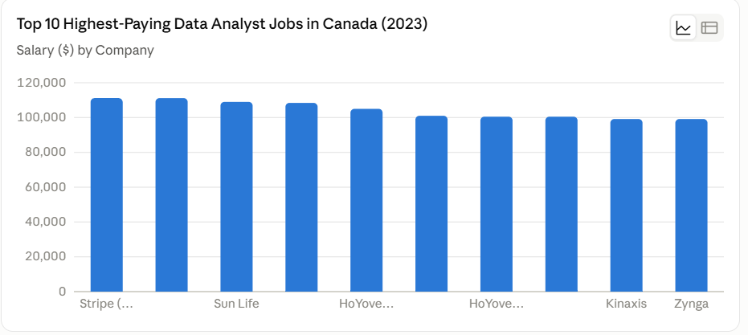

# Overview
Exploring data analyst roles, the highest-paying positions, in-demand skills, and where strong demand meets high salaries in data analytics.
SQL queries? chech them out here : [project_sql folder](/project_sql/)

# Background
I created this project to gain a deeper understanding of the data analyst job market in Canada and identify the skills that can help aspiring data analysts make more informed career decisions.

Using SQL, I analyzed job postings to explore salary trends, in-demand skills, job titles, and locations across the Canadian data analytics market. The goal was to identify which skills are most sought after by employers, which are associated with higher salaries, and where demand and earning potential intersect.

The dataset used in this analysis comes from my SQL data analytics work and includes information on job titles, salaries, locations, and required skills. You can explore more of my data analytics projects on my [GitHub profile](https://github.com/isaacabakah22-beep).

Questions I wanted to answer through my SQL analysis:
1. What are the highest-paying data analyst roles in  Canada?
2. Which skills are required for the highest-paying data analyst jobs?
3. What are the most in-demand skills for data analysts in Canada?
4. Which skills are associated with higher average salaries?
5. Which skills offer the best combination of high demand and strong earning potential?

# Tools I used
- **SQL:** The primary language used to query, clean, transform, and analyze the job posting data and uncover key insights.
- **PostgreSQL**: The relational database management system used to store and query the dataset.
- **Visual Studio Code:** My development environment for writing, organizing, and executing SQL queries.
- **Git & GitHub:** Used for version control, project documentation, and showcasing my SQL scripts and analysis.

# The analysis
Each SQL query was designed to answer a specific question about the Canadian data analyst job market.
The analysis focused on identifying salary trends, in-demand skills, and the skills associated with higher-paying opportunities.
Here is how I approached each question:

### 1. Top-Paying Data Analyst Jobs

To identify the highest-paying Data Analyst opportunities in Canada, I filtered the job postings to include only Data Analyst roles located in Canada with reported annual salaries.

I then sorted the positions by average yearly salary in descending order and limited the results to the top 10. This analysis provides a snapshot of the highest-paying Data Analyst opportunities and the companies, locations, and job schedules associated with them.

```sql
SELECT
    job_id,
    job_title,
    job_location,
    job_schedule_type,
    name AS company_name,
    salary_year_avg,
    job_posted_date
FROM job_postings_fact
LEFT JOIN company_dim
    ON job_postings_fact.company_id = company_dim.company_id
WHERE
    job_title_short = 'Data Analyst' AND
    job_location = 'Canada' AND
    salary_year_avg IS NOT NULL
ORDER BY
    salary_year_avg DESC
LIMIT 10;
```
Here's the breakdown of the top-paying data analyst jobs in Canada:

***Highest salary:*** Stripe has the two highest-paying roles at $111,175 CAD annually.
Strong salary range: The top 10 roles range from $99,150 to $111,175 CAD.

***High-paying market segment:*** 9 out of 10 roles offer salaries above $100,000 CAD.

***Employer concentration:*** HoYoverse appears 3 times, while Stripe and Swiss Re each appear 2 times.

***Full-time opportunities:*** All 10 positions are full-time.
Average salary: The average salary across the 10 postings is approximately $104,008 CAD.



Histogram visuals with the assistant of Claude.

### 2. Top-paying Job Skills
```sql
WITH top_paying_jobs AS(
    SELECT
            job_id,
            job_title,
            salary_year_avg,
            name AS company_name
            
        FROM job_postings_fact

        LEFT JOIN company_dim 
        ON job_postings_fact.company_id = company_dim.company_id

        WHERE   
            job_title_short = 'Data Analyst' AND
            job_location = 'Canada' AND
            salary_year_avg IS NOT NULL

        ORDER BY
            salary_year_avg DESC

        LIMIT 10
)

SELECT 
    top_paying_jobs. *,
    skills_dim.skills

FROM top_paying_jobs
INNER JOIN skills_job_dim ON top_paying_jobs.job_id = skills_job_dim.job_id
INNER JOIN skillS_dim ON skills_job_dim.skill_id = skills_dim.skill_id

ORDER BY
    salary_year_avg DESC

```

()
* Bar graph showing top demand skills for a Data Aanalyst in Canada; ChatGPT generated this from my sql query results * 

***SQL and Python lead:*** Both SQL and Python appear in 6 of the 9 unique job postings represented in this result, making them the most frequently required skills among these high-paying roles.
***Spark is also prominent:*** Spark appears in 4 job postings, followed by Hadoop and Excel, which each appear in 3.
***Visualization skills matter:*** Tableau appears in 2 postings, while one posting specifically requires VBA and Excel, highlighting the continued presence of traditional analytics tools.
***Specialized technologies appear in individual roles:*** Skills such as Azure, Databricks, TypeScript, SAS, SPSS, Express, and SAP each appear in one posting.
***Technical breadth:*** The results suggest that high-paying analytics roles can require a combination of SQL, programming, big-data technologies, visualization tools, and specialized business technologies.

### 3. Top-demanded Skills

```sql
SELECT 
    skills,
    COUNT(skills_job_dim.job_id) AS demand_count
FROM job_postings_fact
INNER JOIN skills_job_dim ON job_postings_fact.job_id = skills_job_dim.job_id
INNER JOIN skillS_dim ON skills_job_dim.skill_id = skills_dim.skill_id

WHERE   job_title_short = 'Data Analyst' AND 
        job_location = 'Canada' AND
        job_schedule_type = 'Full-time'

GROUP BY
    skills

    ORDER BY
        demand_count

LIMIT 5
```
| Skills   | Demand Count |
|----------|--------------|
| SQL      | 528          |
| Excel    | 371          |
| Python   | 324          |
| Tableau  | 253          |
| Power BI | 226          |
Key Insights

***SQL*** is the most in-demand skill, appearing 528 times, significantly ahead of the other skills.

***Excel*** ranks second with 371 mentions, showing that spreadsheet skills remain highly relevant.

***Python*** follows with 324 mentions, highlighting the importance of programming and data analysis skills.

***Tableau*** (253) and ***Power BI*** (226) show strong demand for data visualization and business intelligence tools.
Overall, the results suggest that SQL, Excel, Python, and visualization tools form a strong core skill set for data analyst roles in this dataset.

### 4. Top-paying Skills

```sql
SELECT 
    skills,
    ROUND(AVG(salary_year_avg), 0) AS average_salary
FROM job_postings_fact
INNER JOIN skills_job_dim ON job_postings_fact.job_id = skills_job_dim.job_id
INNER JOIN skillS_dim ON skills_job_dim.skill_id = skills_dim.skill_id

WHERE   job_title_short = 'Data Analyst' AND 
        job_location = 'Canada' AND
        salary_year_avg IS NOT NULL 

GROUP BY
    skills

    ORDER BY
        average_salary DESC

LIMIT 10

```

| Skills     | Average Salary |
|------------|-----------------|
| TypeScript | $108,416        |
| Spark      | $107,479        |
| Hadoop     | $107,167        |
| Azure      | $101,014        |
| Databricks | $101,014        |
| SAP        | $99,150         |
| Express    | $99,150         |
| Python     | $94,302         |
| Tableau    | $88,550         |
| SQL        | $88,452         |

Based on the findings;

***TypeScript, Spark, and Hadoop*** have the highest average salaries, each exceeding $107K CAD.

***Cloud and big-data skills*** such as Azure, Databricks, Spark, and Hadoop are associated with higher salaries in this dataset.
Python averages $94,302, while ***SQL*** averages $88,452, despite both being highly in-demand skills.

***Tableau*** averages $88,550, placing it close to SQL in salary level.

Overall, the results suggest that specialized technical skills tend to be associated with higher average salaries, while foundational skills such as ***SQL and Tableau*** show lower averages in this dataset.

### 5. Optimal Skills
```sql
WITH skills_demand AS (
    SELECT 
        skills_dim.skill_id,
        skills_dim.skills,
        COUNT(skills_job_dim.job_id) AS demand_count
    FROM job_postings_fact
    INNER JOIN skills_job_dim ON job_postings_fact.job_id = skills_job_dim.job_id
    INNER JOIN skillS_dim ON skills_job_dim.skill_id = skills_dim.skill_id

    WHERE   job_title_short = 'Data Analyst' AND 
            job_location = 'Canada' AND
            job_schedule_type = 'Full-time' AND
            salary_year_avg IS NOT NULL 

    GROUP BY
        skills_dim.skill_id
), 
 average_salary AS (

    SELECT 
        skills_job_dim.skill_id,
        skills,
        ROUND(AVG(salary_year_avg), 0) AS average_salary
    FROM job_postings_fact
    INNER JOIN skills_job_dim ON job_postings_fact.job_id = skills_job_dim.job_id
    INNER JOIN skillS_dim ON skills_job_dim.skill_id = skills_dim.skill_id

    WHERE   job_title_short = 'Data Analyst' AND 
            job_location = 'Canada' AND
            salary_year_avg IS NOT NULL 

    GROUP BY
        skills_job_dim.skill_id,
        skills

)

SELECT
    skills_demand.skill_id,
    skills_demand.skills,
    demand_count,
    average_salary

FROM skills_demand
INNER JOIN average_salary ON skills_demand.skill_id = average_salary.skill_id

ORDER BY
    average_salary DESC,
    demand_count DESC
    
    LIMIT 15
```
| Skills     | Demand Count | Average Salary |
|------------|--------------|-----------------|
| TypeScript | 1            | $108,416        |
| Spark      | 4            | $107,479        |
| Hadoop     | 3            | $107,167        |
| Azure      | 1            | $101,014        |
| Databricks | 1            | $101,014        |
| Express    | 1            | $99,150         |
| SAP        | 1            | $99,150         |
| Python     | 8            | $94,302         |
| Tableau    | 3            | $88,550         |
| SQL        | 9            | $88,452         |
| Excel      | 5            | $83,413         |
| VBA        | 3            | $79,000         |
| SPSS       | 2            | $79,000         |
| SAS        | 2            | $79,000         |
| SAS        | 2            | $79,000         |

***SQL and Python*** are the most in-demand skills, with 9 and 8 postings respectively.

Specialized skills such as ***Spark and Hadoop*** have some of the highest average salaries.

***Excel, VBA, and SPSS/SAS*** show lower average salaries compared with more technical skills.

Overall, the results show that high demand does not always mean higher salary in this dataset.

# What I learned
Through this project, I strengthened my intermediate SQL skills and applied them to real-world data analysis:

***🧩 Query Development:*** Built queries using JOIN, WITH (CTEs), filtering, and sorting to analyze job-market data.

***📊 Data Aggregation:*** Used GROUP BY and functions such as COUNT() and AVG() to summarize and compare data.

***💡 Analytical Problem-Solving:*** Translated business questions into practical SQL queries to uncover meaningful insights from the data.

# Conclusion
Working on this project allowed me to apply my SQL skills to a real-world dataset and get a better understanding of the Canadian Data Analyst job market. I explored salaries, in-demand skills, and employer requirements, while improving my confidence in writing and analyzing SQL queries.

More importantly, this project showed me how SQL can turn raw job-posting data into insights that can support real career decisions. It was a valuable step in developing my skills as an aspiring data analyst.
